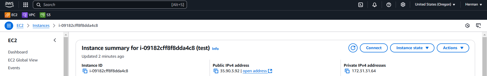
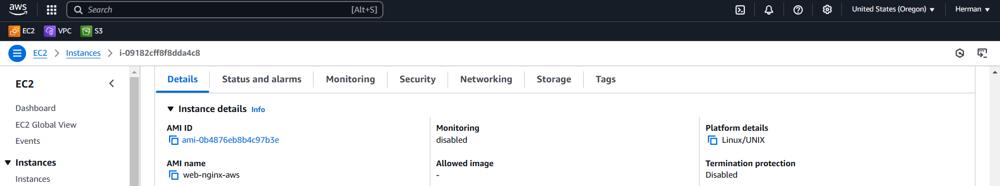
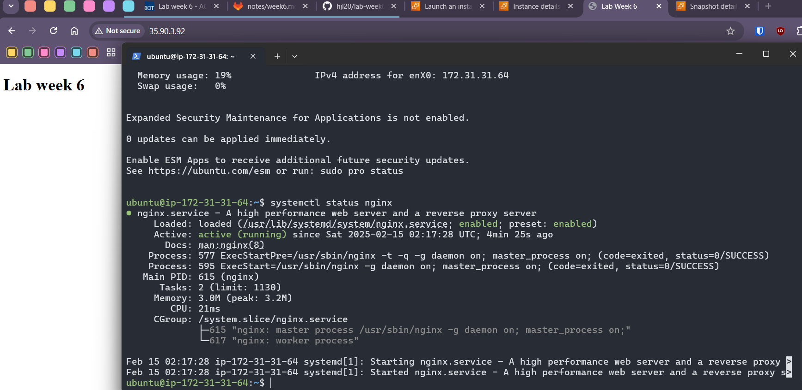

# lab-week6-packer

## Packer setup and build
1. In your project directory, use command `packer init .` to initialize Packer providers
1. Use `packer fmt .` to format your template
1. Use `packer validate .` to validate your template syntax
1. Use `packer build` to create your resources
1. Once finished, clean up your resources by deregistering the AMI and deleting the snapshots

## Screenshots
Instance public IP

Instance using packer built AMI

Accessible via public IP
